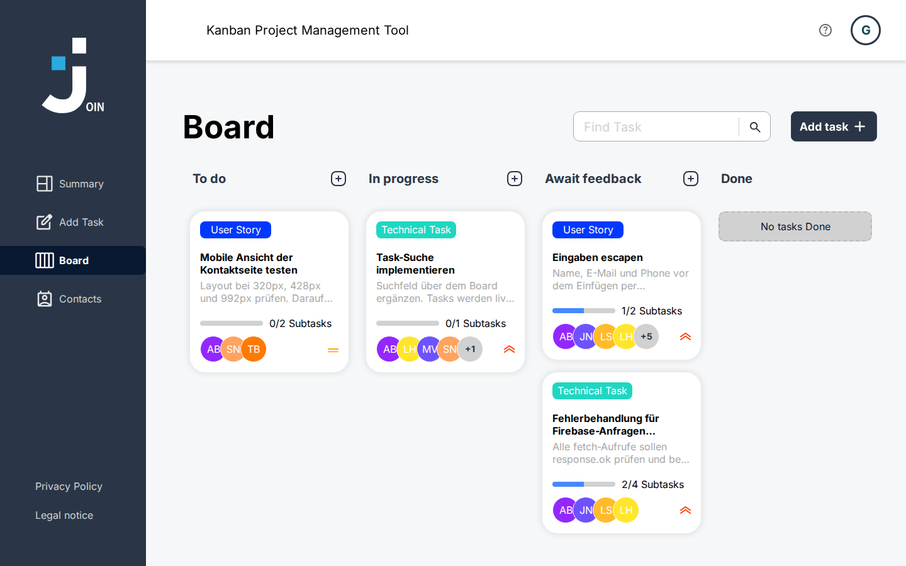
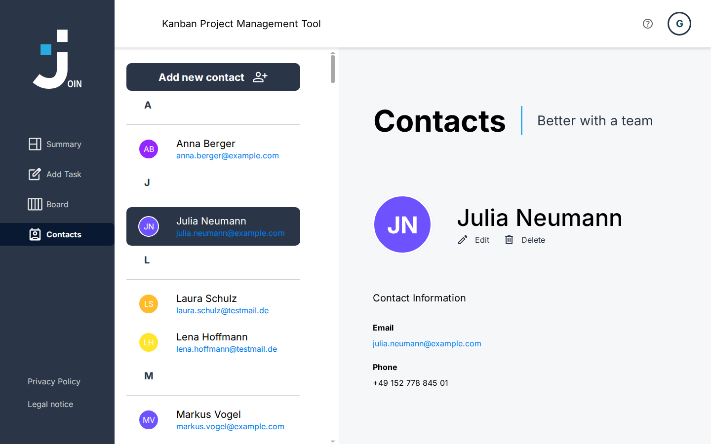

# Join 360 – Kanban Project Management Tool

Join is a Kanban-based project management tool. Users can create tasks, assign them to contacts and move them across a board from "To do" to "Done".
It was built as a student group project at the Developer Akademie with plain HTML, CSS and JavaScript – no frameworks.

**Live demo:** https://oeztuerk1992.github.io/Join-Project/ (click **Guest Log in** to try it without an account)



---

## Features

- **Log in / Sign up** – Create an account or log in with email and password. A guest login is available to try the app without an account.
- **Summary** – Key figures at a glance: tasks in progress, urgent tasks, the next deadline and a personal greeting.
- **Board** – Kanban board with the columns *To do*, *In progress*, *Await feedback* and *Done*. Tasks can be moved by drag & drop, searched, viewed, edited and deleted.
- **Add Task** – Create tasks with title, description, due date, priority, category, assigned contacts and subtasks.
- **Contacts** – Alphabetically grouped contact list with a detail view. Contacts can be added, edited and deleted.
- **Help, Legal Notice, Privacy Policy** – Information pages for users.
- **Responsive design** – Optimized for desktop, tablet and mobile (portrait mode, from 320 px width).

---

## Tech Stack

- HTML5
- CSS3
- JavaScript (Vanilla)
- Firebase Realtime Database (storage for users, contacts and tasks)

---

## Getting Started

1. Clone the repository:
```bash
   git clone https://github.com/Oeztuerk1992/Join-Project.git
```
2. Open the project folder in VS Code.
3. Start **Live Server** from the project root folder (not from a subfolder).
4. Open `index.html` – you land on the login page.
5. Create an account with **Sign up**, or click **Guest Log in**.

---

## Project Structure

```
index.html            Login page (start page)
html/                 All other pages (signup, summary, board, add_task, contacts, help, ...)
scripts/              JavaScript files, grouped by page (add_task/, board/, contact/, startpage/)
scripts/templates/    Functions that return HTML templates
styles/               CSS files, one file per page or component
assets/               Images, icons and fonts
```

---

## My Contribution (Sinan Öztürk)

- **Contacts page** – alphabetically grouped contact list, animated detail panel, overlays to add, edit and delete contacts with form validation, custom scrollbar, responsive layout down to 320 px
- **Sidebar and header** – navigation sidebar, header with help icon and user menu
- **Final review phase** – worked through the mentor feedback: responsive fixes, moving tasks by touch on tablets, redirect to the login page for visitors who are not logged in, clean-code rules (max. 14 lines per function, max. 400 lines per file, JSDoc for every function)



---

## Team

| Name | GitHub |
|------|--------|
| Sinan Öztürk | [@Oeztuerk1992](https://github.com/Oeztuerk1992) |
| Rico Elmerich | [@ricoelmerich](https://github.com/ricoelmerich) |
| Mehmet Sefa Gürcan | [@Yavuba](https://github.com/Yavuba) |

---

## Design

UI designed in Figma. Font: [Inter](https://fonts.google.com/specimen/Inter)